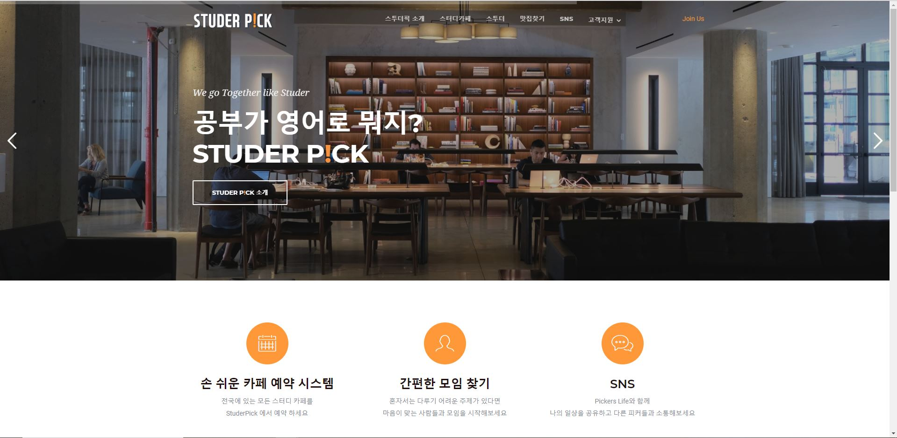
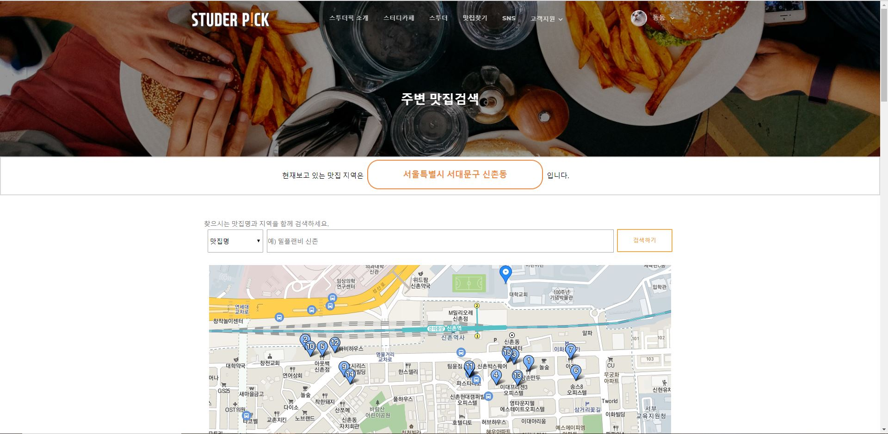

**스터디카페 실시간 예약과 스터디모임 개설 및 모집을 중계해주는 모임 플랫폼 웹 어플리케이션**  
2019년 비트캠프 자바개발자 양성과정 팀 프로젝트로 진행되었으며 개발기간은 2019.10.20 ~ 11.20 입니다.  

## 개발환경  
- Java
- Apache Tomcat 9.0
- JDBC - Oracle
- JSP / CSS / Servlet
- JQuery, Ajax, JSON, JSTL
- Bootstrap
- Eclipse, SpringTooSuite(STS), Bracket

## 어플리케이션 기능
 - 스터디카페 실시간 예약과 스터디모임 개설 및 모집, 신청할 수 있는 시스템 구현
 - 사용자위치기반 주변 맛집추천 및 검색 기능
 - 추천맛집에 대한 정보를 열람하기 위한 블로그 웹크롤링
 - 웹사이트 이용자를 위한 SNS 기능(팔로잉, 팔로워, 게시글 등록 및 검색)
  
## 보완점  
- 데이터 전송간의 GET방식의 QueryString으로 보안에 취약
- JDBC PreparedStatement를 활용한 SQL Injection 방어
- JSP에서 스크립틀릿을 통한 로직의 처리 Servlet와 JSTL을 활용하여 변경
- 일부 기능 크로스 브라우징 미지원
- 메시지와 회원간의 테이블 관계 외래키 설정

## 담당 파트(*자세한 사항은 ppt 참고*)
- 맛집페이지 dining.jsp / DiningController.java
- 개인마이페이지 custMyPage.jsp / MPController.java
- 스터디모임 개설페이지 insertStd.jsp / StdController.java
- 스터디모임 수정페이지 updateStd.jsp / StdController.java
- 스터디모임 관리페이지 manageStd.jsp / StdController.java
- SNS 전체목록페이지 schSNS.jsp / SNSContoroller.java

               
